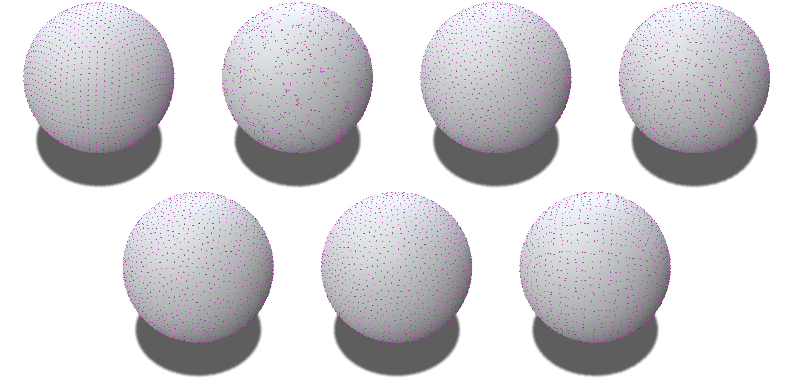
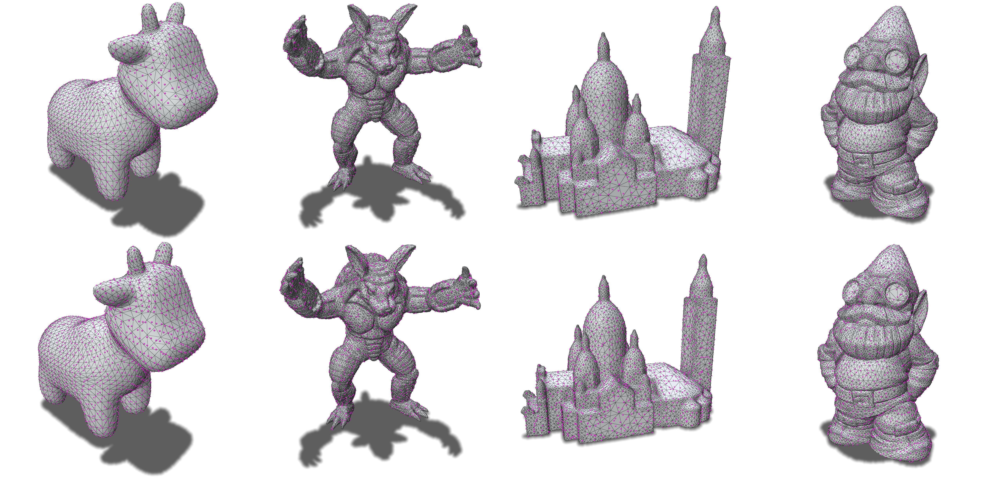

# Hilbert Curve Projection for Optimal Transport Sampling on a Sphere Surface


This repository aims to generate blue noise samples on the sphere by Hilbert Curve Projection.





(regular, whitenoise, dartthrowing, stratified, poissondisk, NESOTS, HCPSOTS)



The first row is the result of NESOTS, the second row is the result of HCPSOTS.

<!--  -->

This repository is based on the following repositories :

[NESOTS](https://github.com/baptiste-genest/NESOTS)

[HCP](https://github.com/sherlockLitao/HCP)

[CEPS](https://github.com/MarkGillespie/CEPS.git)

##  Getting started

We use CMake to build the project with the following commands from the root folder :
 ```bash
 mkdir build 
 cd build
 cmake ..
 make -j20
 ```

## Usage
In the build folder, you can run the following command to generate samples on a sphere :
```bash
./tests
```

## Third Party Libraries
- [geometry-central](https://libigl.github.io/) 
- [polyscope](https://polyscope.run/) 
- [eigen](https://eigen.tuxfamily.org/index.php?title=Main_Page) 
- [bvh](https://github.com/madmann91/bvh)


## References
[1] Li, Tao, et al. "Hilbert curve projection distance for distribution comparison." IEEE Transactions on Pattern Analysis and Machine Intelligence 46.7 (2024): 4993-5007.

[2] Genest, Baptiste, Nicolas Courty, and David Coeurjolly. "Non‐Euclidean Sliced Optimal Transport Sampling." Computer Graphics Forum. Vol. 43. No. 2. 2024.

[3] Gillespie, Mark, Boris Springborn, and Keenan Crane. "Discrete conformal equivalence of polyhedral surfaces." ACM Transactions on Graphics (TOG) 40.4 (2021): 1-20.